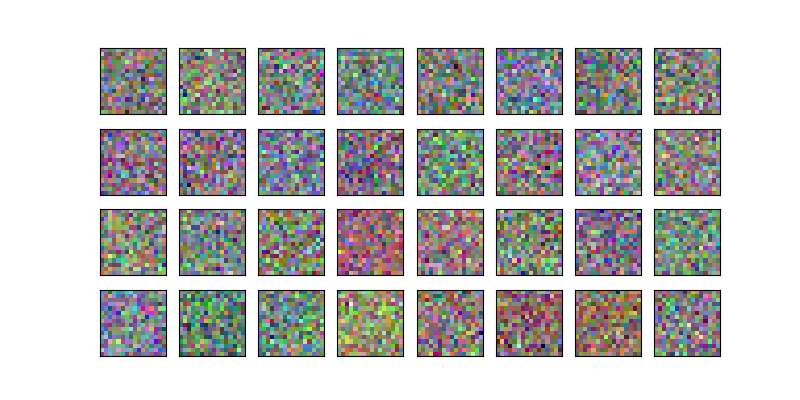
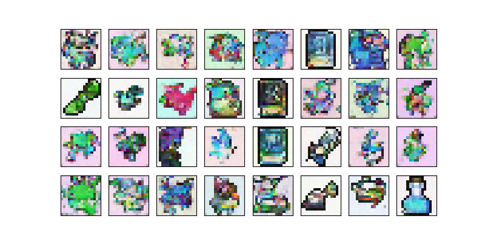

Here we study a simple model for stable diffusion.
Starting from a noise.

The model uses 30 steps of "inverse diffusion" to generate the following images which are more or less look like the sprites on what the model was trained on. Thus, it shows the model is capable of learning the distribution of the training set. These are some random samples from it. It was inspired by the DeepLearning.AI tutorial.

